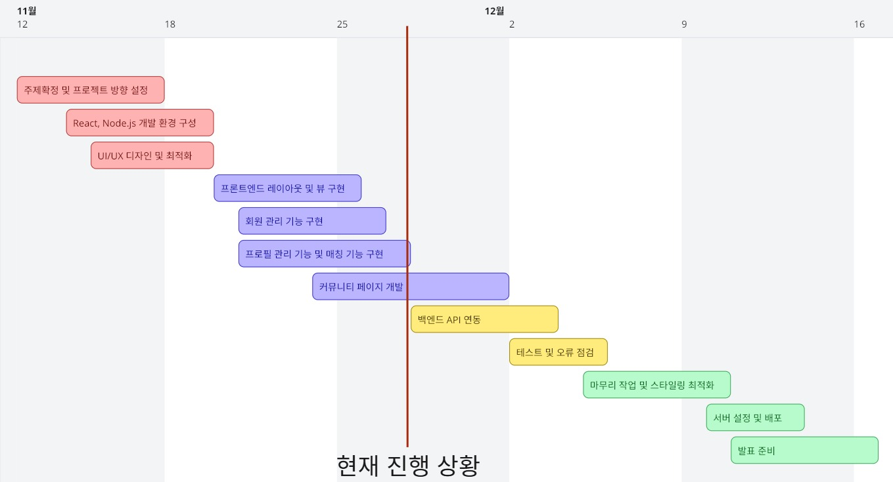
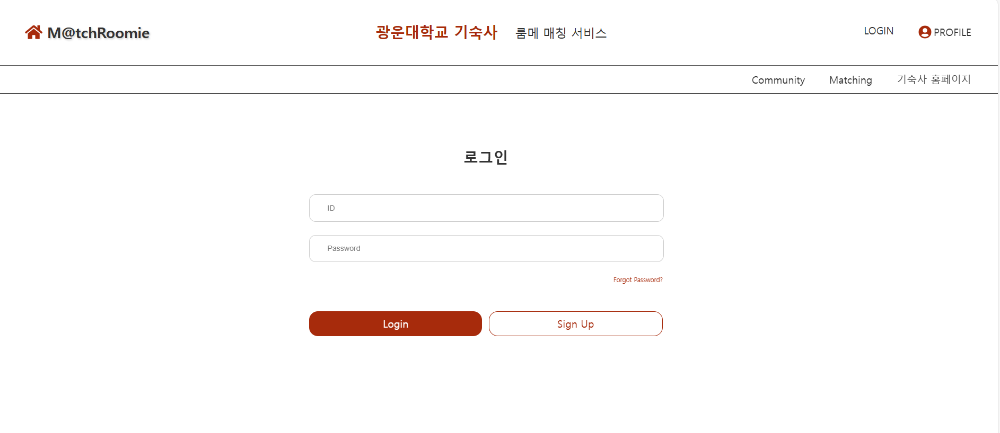
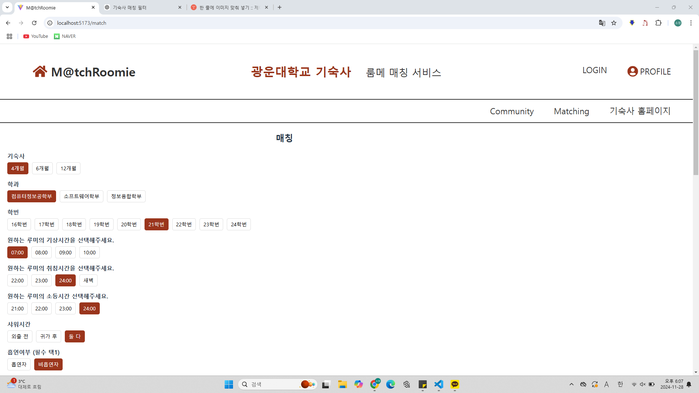
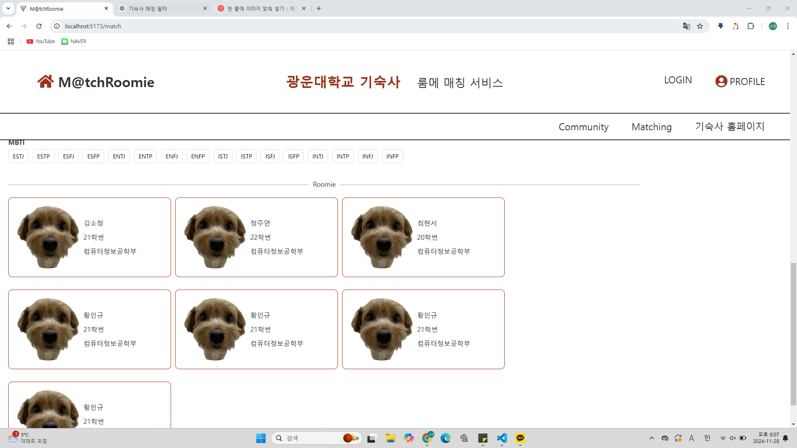
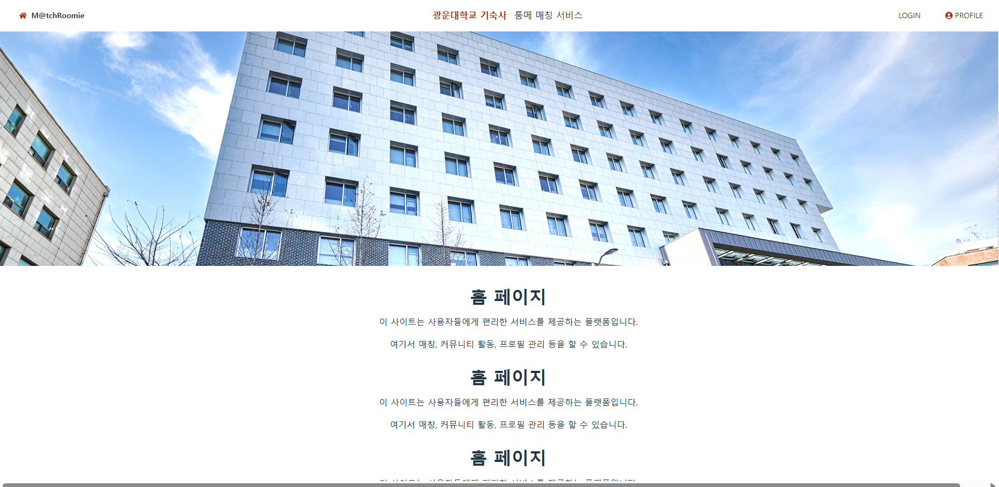

# Progress Report for Team #3

## Progress Summary

#### Front-End

- 전체적인 UI/UX 디자인 완료
- 설계된 디자인을 바탕으로 화면 구조와 레이아웃 구현 완료
  - 로그인 페이지, 메인 홈페이지, 매칭 페이지, 프로필 설정 페이지 등 주요 화면 개발 완료
- TODO : 서버 API와의 연동 작업 예정

#### Back_End

- 서버 환경 초기 세팅 완료 (프로젝트 구조 설정 및 기본 환경 구성)
- 주요 API 약 80% 개발 완료
- TODO : 남은 API 구현 및 테스트, 프론트엔드와의 통합 작업

### Project Schedule

### Project ScreenShot

### Individual Progress Status  
**황인규 ([Commit Link]())**
- 전체 API 약 80% 개발 완료

**정주연 ([Commit Link]())**
- 홈 페이지, 로그인 관련 페이지 뷰 구현 완료

**김소정 ([Commit Link]())**
- 매칭 페이지 뷰 구현 완료

**최현서 ([Commit Link]())**
- 프로필 페이지 뷰 구현 완료
