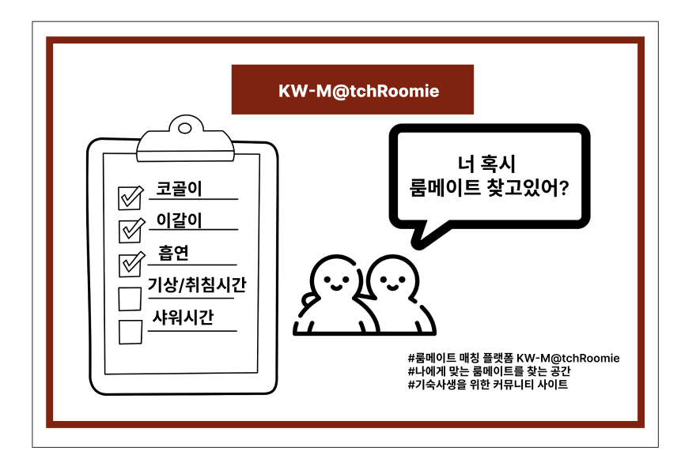

# KW-MatchRoomie

## 프로젝트 이름
- KW-MatchRommie

## 프로젝트 요약 (Abstract)
- 룸메이트 매칭 플랫폼
- 나에게 맞는 룸메이트를 찾는 공간
- 기숙사생을 위한 커뮤니티 사이트

## 프로젝트 이미지

## 프로젝트 일정
### 1주차 (11월 12일 ~ 11월 18일)
- 개발 환경 구축
- 프로젝트 이미지 디자인
- 프로젝트 기능목록 구체화
- ERD 설계
### 2주차 (11월 19일 ~ 11월 25일)
- 주요기능 구현
  - 로그인 기능
  - 프로필 기능
  - 매칭 시스템
### 3주차 (11월 26일 ~ 12월 2일)
- 기능별 백엔드 API 연동
- 테스트: 단위 테스트 및 통합 테스트를 통해 기능별 오류 점검
### 4주차 4주차 (12월 3일 ~ 12월 9일): 최종 점검 및 배포 준비
- 버그 수정 및 코드 정리: 마지막 버그 수정과 코드 리팩토링
- 배포 환경 구축: 서버 설정 및 배포
### 마감일 (~12월 17일)
최종 제출 및 발표 준비

## 팀 역할 분담
| 역할 | 팀원 | 담당 업무 |
|---|---|---|
| 백엔드 개발 | 황인규 | 백엔드 기능 구현 |
| 백엔드 개발 & 디자인 | 최현서 | UI/UX 설계, 백엔드 기능 구현  |
| 프론트 엔드 개발 | 정주연 | 프론트엔드 기능 구현 |
| 프론트 엔드 개발 | 김소정 | 프론트엔드 기능 구현 |

## 프로젝트 기술 목록
### **1. 프로그래밍 언어 및 프레임워크**
#### 백엔드
- Node.js, MySQL
#### 프론트엔드
- React.js
### **2. 개발 도구 및 환경**
- Git & GitHub: 버전 관리 및 협업 툴
- IntelliJ / VSCode: 통합 개발 환경(IDE, 서버/프론트)
- postman: API 테스트 및 디버깅
- Docker: 컨테이너 기반 배포 환경 구축(미확정)
### **3. 디자인 및 UI/UX 툴**
- Figma: 프로토타입 설계 및 UI 디자인
### **4. 배포 및 운영**
- AWS EC2: 서버 호스팅 및 배포
- AWS RDS: 데이터베이스 호스팅
- CI/CD(깃허브 액션 & Docker): 자동 배포 파이프라인 구축 (미확정)
